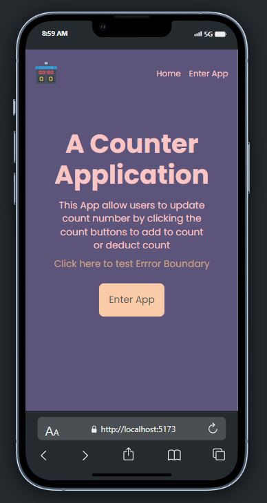
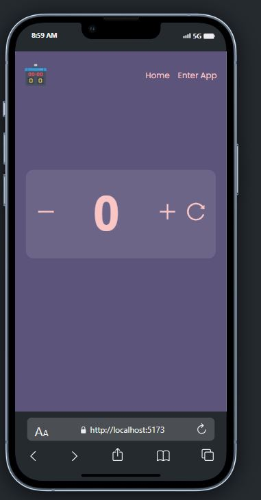
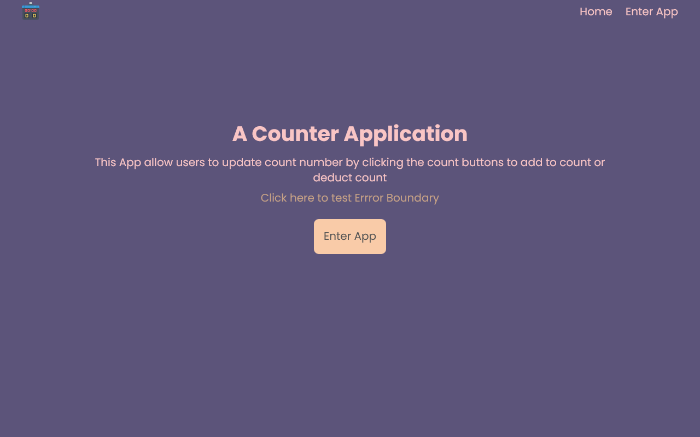
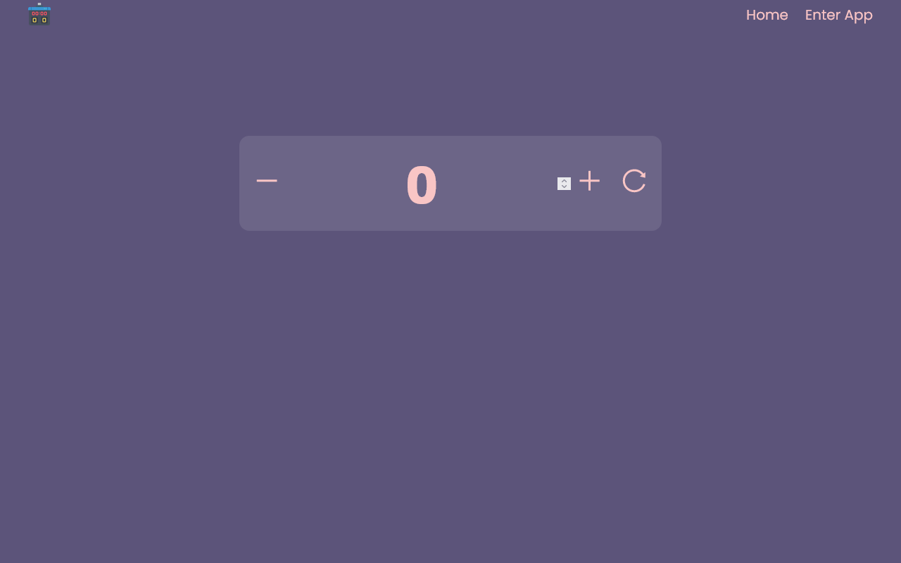

# Counter Application

A simple counter application built using React. This application allows users to increment, decrement, and reset a counter value.

## Table of Contents

- [Features](#features)
- [Prerequisites](#prerequisites)
- [Installation](#installation)
- [Usage](#usage)
- [Folder Structure](#folder-structure)
- [Custom Hook](#custom-hook)
- [Styling](#styling)
- [Error Handling](#error-handling)

## Features

- **Increment:** Increase the counter value by one.
- **Decrement:** Decrease the counter value by one.
- **Reset:** Reset the counter to its initial value.
- **Error Handling:** React Error Boundary to handle errors gracefully.
- **Navigation:** Basic navigation between the homepage and counter views.

## Prerequisites

Before you begin, ensure you have met the following requirements:

- **Node.js:** Make sure you have Node.js installed on your system. You can download it [here](https://nodejs.org/).

## Installation

1. Clone the repository:

2. Install dependencies: npm install

3. Start the development server: npm start

4. Open your web browser and navigate to http://localhost:3000 to use the application.

Folder Structure
The project is organized as follows:

src/: Source code.
components/: React components.
Styles/: CSS files for styling.
App.js: Main application component.
index.js: Application entry point.
Custom Hook
The useCounter custom hook provides count management functions. You can find it in src/components/useCounter.js.

Styling
Styling is done using CSS. You can customize the styles in the CSS files located in the Styles/ directory.

Error Handling
The application uses React Error Boundary for error handling. When an error occurs in a component, it is caught by the error boundary and displays an error message. The error message and "Go back to homepage" link can be customized.
